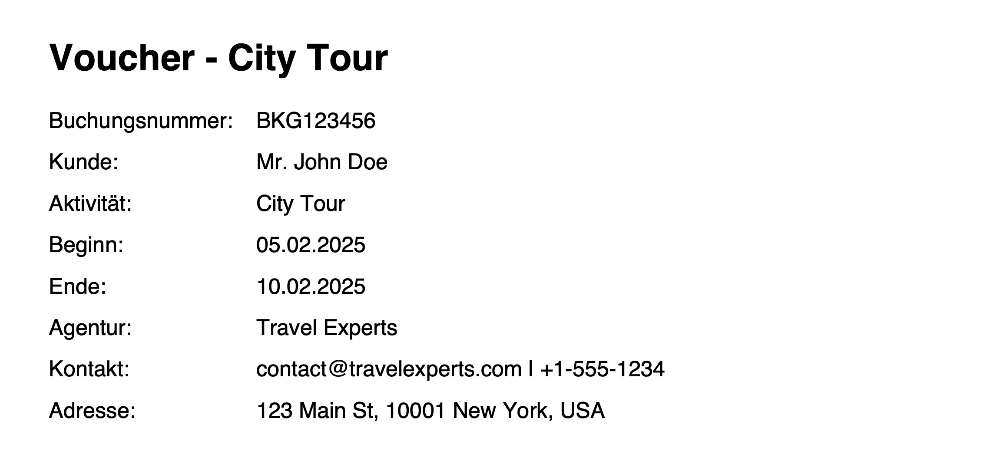

# go-voucher-service

This service generates a basic pdf voucher with the given booking data payload. It has a basic translation dictionary.



### Setup

-   Run

```bash
go run .
```

-   Generate voucher for testing
<!-- create file in voucher directory -->

```bash
curl -X POST 'http://localhost:8080/voucher?lang=de' \
  -H 'content-type: application/json' -o voucher.pdf \
  -d '{
	"bookingId": "BKG123456",
	"activity": {
		"id": "ACT987654",
		"name": "City Tour",
		"code": "CT001",
		"startDate": "2025-02-05",
		"endDate": "2025-02-10"
	},
	"agency": {
		"id": "AGY555555",
		"name": "Travel Experts",
		"city": "New York",
		"postcode": "10001",
		"streetAndNumber": "123 Main St",
		"country": "USA",
		"phone": "+1-555-1234",
		"email": "contact@travelexperts.com",
		"countryCode": "US"
	},
	"client": {
		"firstName": "John",
		"lastName": "Doe",
		"salutation": "Mr."
		}
}'
```
